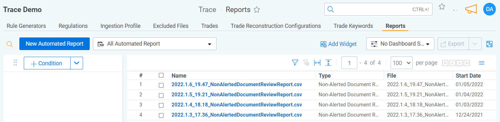
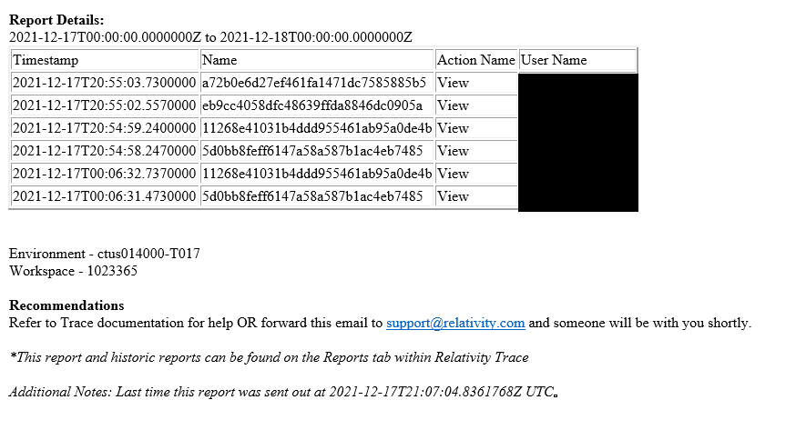

# Notifications
{: .no_toc }

Trace can send email notifications and generate reports for non-communication alert related events.
{: .fs-6 .fw-300 }

1. TOC
{:toc}

---
## Reports
Each report sends an email notification and creates an Automated Reports object. Automated Report objects can be found within Trace on the Reports tab. On the Reports tab you can filter to find any report by type and by the date it was generated. Within an Automated Report object you can view or download a CSV of the underlying report details.

All reports are configured by system administrators. For configuration information, see the [Admin Guide](docs/administrator_guide/reporting/notifications.html)
{: .info}

### Non-Alerted Document Review Report
Companies can track when surveillance team members view communications that have not been alerted on to identify scenarios where compliance team members are abusing their access to view employees communications. Trace will send an email report or real-time notifications regarding these privacy issues where reviewers are looking at non-alerted documents. 

Sample notification emailed with attachment 
Sample report file 

### Rule Change Report
Compliance teams must be aware of any changes or additions made to the Rules that are generating alerts. This report sends email notifications when a change or addition is made so those who aren't using Trace every day are aware of how monitoring is changing and identify any questionable activities by the compliance team.

Sample notification emailed with attachment  

Sample csv  

### System Health Report
The Trace team gets notified of system health issue in realtime and remediates and problems proactively. If you want greater awareness when system issues occur, this report will send you email notifications for each event.

Sample notification emailed with attachment 
Sample csv 

**General Notes:** 
- If there are no incidents, the email will be sent but not have content
- Notifications only review previous day, not historical data
{: .info}
