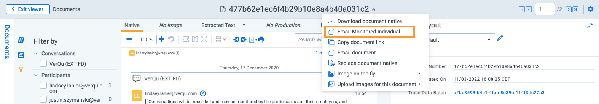
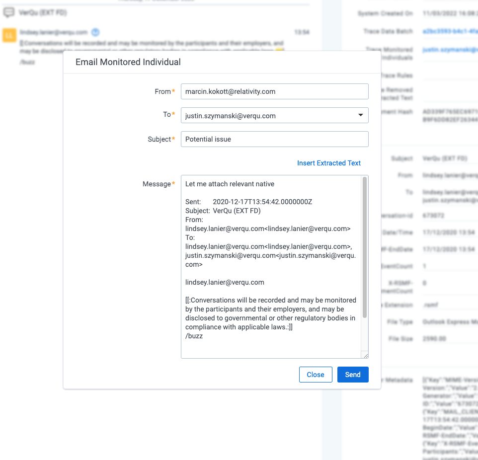
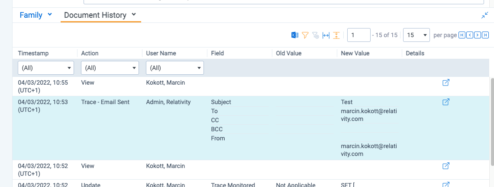

# Contacting a Monitored Individual
{: .no_toc }

Reviewers have the ability to contact a Monitored Individual regarding a specific communication to get more context around the events that unfoldeded or notify them that they are in breach of a policy.
{: .fs-6 .fw-300 }

1. TOC
{:toc}

---

## Overview
When reviewing a communication within the Viewer you can "Email  Document Actions Menu

1. Click on the Document Action Menu that appears next to the document control number on the top header.
2. Select the "Email Monitored Individual" item in the drop down

3. An "Email Monitored Individual" modal will appear allowing for you to select the Monitored Individual you'd like to contact as well as customize the From, Subject, and Body of the email that will be sent. The "Insert Extracted Text" allows for you to include specific language used in the document within your email.

4. By pressing "Send" the system will generate and automatically send an email to the specified monitored individual.

These email actions are audited as `Trace - Email Sent` actions.

There are currently no permissions to disable the "Email Monitored Individual" functionality.
{: .info }

