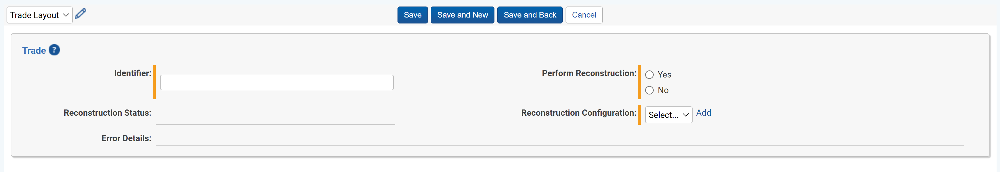

# Trade Reconstruction
{: .no_toc }

Trade Reconstruction is used to automatically link trade and orders from Order Management Systems (OMS) or Trade Capture systems to their related communications.
{: .fs-6 .fw-300 }

1. TOC
{:toc}

---

## Overview

There are several components to Trade Reconstruction. To begin, a Trade Reconstruction Configuration must be created. Trade Reconstruction Configruations are defined by administrators during implementation, more configuration information found [here]({{ site.baseurl }}). Once a Trade Reconstruction Configuration is created, Trades can be reconstructed.

## Creating or Ingesting A Trade

To run Trade Reconstruction, you need a Trade. Trades can be created manually following the steps below or created through an integration with an OMS or Trade Capture system. Trade integrations are configured by administrators during implementation, more information can be found [here]({{ site.baseurl }}).

**Manual Trade Creation**
1. Navigate to `Trades` tab and click `New Trade`.

   

2. The Trade creation form contains the following fields:

   - **Identifier:** the name of the Trade
   - **Reconstruction Status:** uneditable field, shows the current status of the Trade during Trade Reconstruction. It can be in the following statuses:
     - `Empty` - no action has been taken on this Trade
     - `Pending` - Trade is waiting to begin Trade Reconstruction
     - `InProgress` - Trade is in the process of being Reconstructed
     - `Complete` - Trade has successfully finished being Reconstructed
     - `Errored` - Trade Reconstruction has failed to Reconstruct this Trade
   - **Error Details:** uneditable field, if the Trade is in `Errored` status, this field displays why the Reconstruction may have failed
   - **Perform Reconstruction:** y/n field indicating if you want to perform Reconstruction on this Trade
     - More infomormation on this field can be found below in the section `Running Trade Reconstruction`
   - **Reconstruction Configuration:** choose the `Trade Reconstruction Configuration` used to perform Reconsstruction
     - A Trade Reconstruction Configuration is required to run Trade Reconstruction and is configured by a Relativity Trace Administrator. Administrator information on how to set up a Trade Reconstruction Configuration can be found [here]({{ site.baseurl }}).

## Running Trade Reconstruction

To run Trade Reconstruction, follow the steps below:

1. Navigate to your Trade on the `Trades` tab.
2. Click `Edit`
3. On the **Perform Reconstruction** field, select `Yes`
   - This will change the **Reconstruction Status** to `Pending`
   - This field selection will be changed back to `No`, allowing you to select `Yes` the next time you want to Reconstruct this Trade
4. Click `Save`

Your Trade will be fully Reconstructed when the **Reconstruction Status** field says `Complete`.

If you choose to perform Reconstruction again on Trade that has already been Reconstructed, this will completely remove any information about the previous Reconstruction.
{: .danger }

